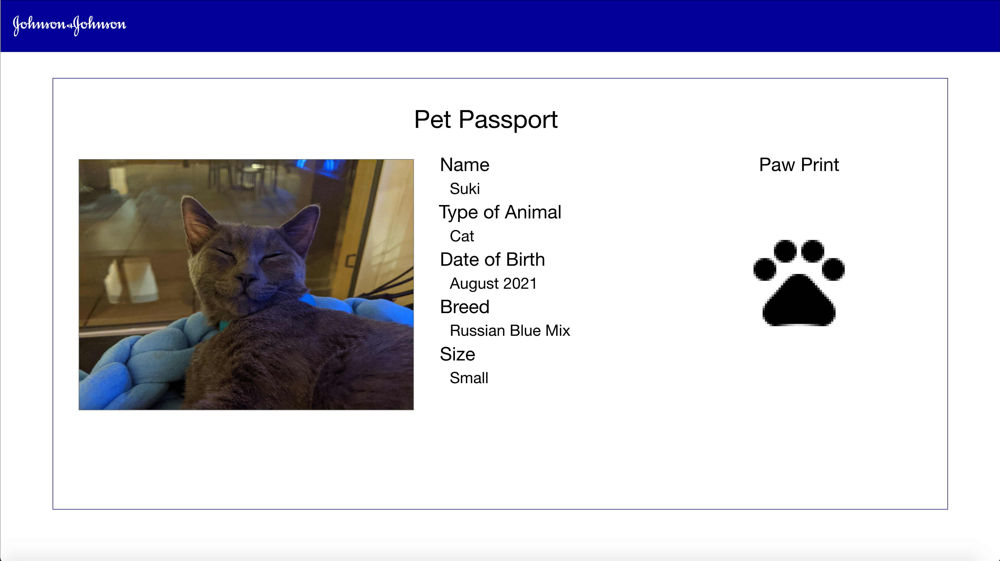

# Pet_Passport

# Solution is on the demoDay1 branch

Some Notes: 
This project was intended to teach new folks at J&J on how to translate a Wireframe / Picture into a React App. 

This was supplemented by some instruction that is not avaliable to the public.

The instruction can be recorded again with enough demand.

# Getting Started with Create React App

This project was bootstrapped with [Create React App](https://github.com/facebook/create-react-app).

## Available Scripts

In the project directory, you can run:

### `npm i`
Installs all the dependencies

### `npm start`

Runs the app in the development mode.\
Open [http://localhost:3000](http://localhost:3000) to view it in your browser.

The page will reload when you make changes.\
You may also see any lint errors in the console.

## Final Product

